# ML-World-Rugby-Results 

The main purpose of this project was to practice an initial **Machine Learning** model.

Specifically, a ***Logistic Regression*** model...along with a ***prediction*** showing the probability of the "***home_team***" to win the match.

The score of the ***Logistic Regression*** model was also compared to the returned by a ***KNN Classification*** model.

## Data Preparation

**1**. I looked for a dataset on Kaggle. 

I took one having info regarding the **"Rugby Results"** of most important teams (South Africa, Ireland, New Zealand, England, France, etc.) since 1871 up to mid August 2024.

**2**. I imported the ***.csv*** file in Python, and I did a first exploration of the data.
 
**3**. I added missing matches of 2024 -> From mid August 2024 up to December 2024.

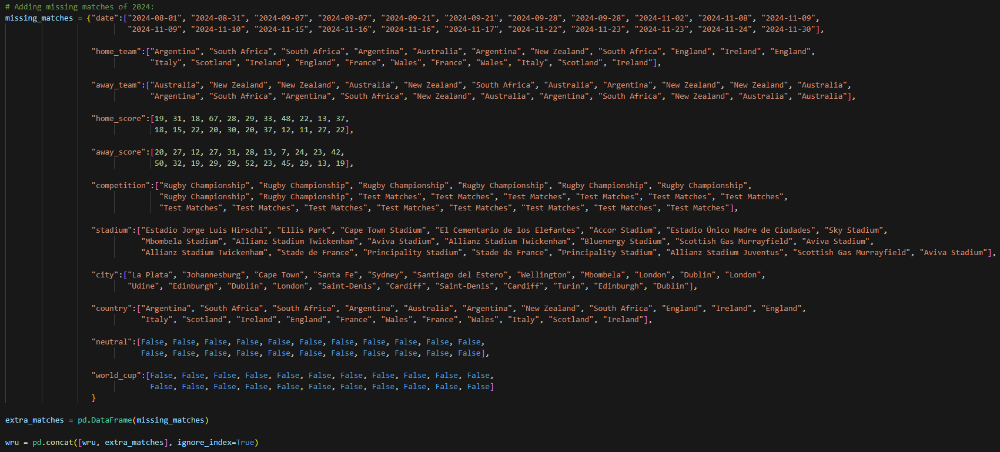

**4**. I created a new column "***score_diff***", being the subtraction of both columns "***home_score***" and "***away_score***".

**5**. I did few vizzes (Hitsplots and Boxplots) of the above mentioned columns in order to check the corresponding data distribution; and consider potential *Transformations*, *Normalizations*, etc.

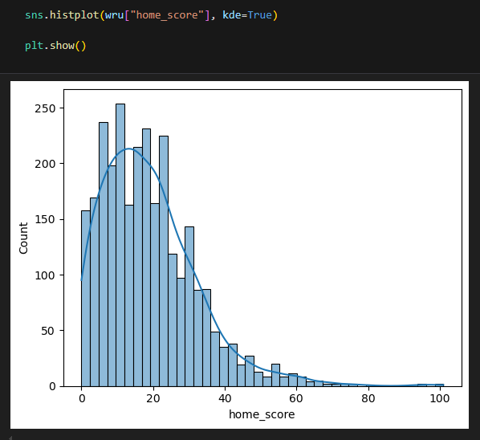
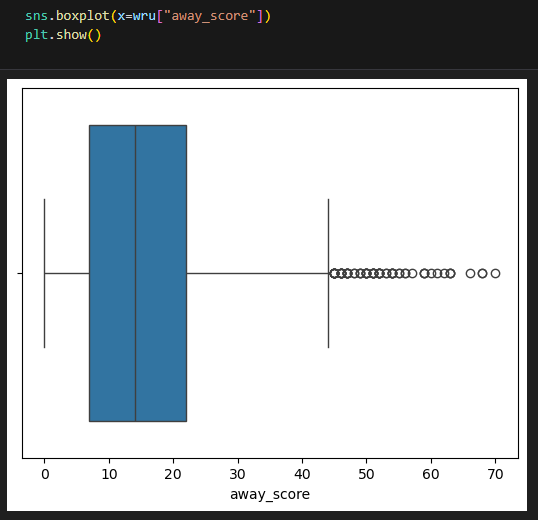
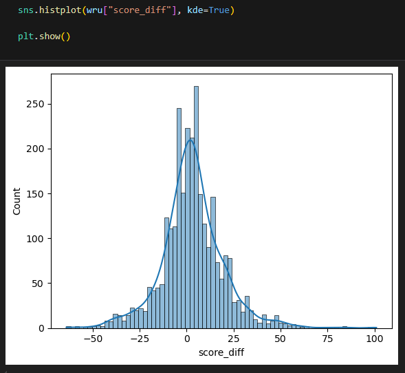

After checking the final outcome of the project, I discarded *Transformations* in both columns since the difference wasn't significant; in addition, since column "***away_score***" was finally dropped for computation purposes.

**6**. I also explored data in columns "***stadium***", "***competition***" or "***country***"; such columns were standardized later on.

## WebScraping

**7**. I webscraped the site ***www.stadiumdb.com*** with ***BeautifulSoup*** in order to get the stadiums' capacities; and join such info in the original dataset:
  - The webscraping was done for each country having an stadium in the original dataset -> Argentina, South Africa, New Zealand, Japan, France, England, Italy, Singapore, etc.
  - I also webscraped historical stadiums, since some of them were appearing in the original dataset too.

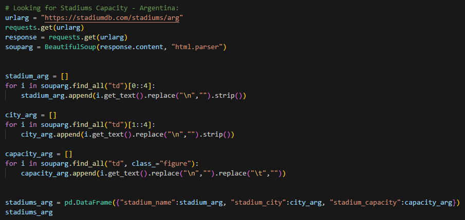
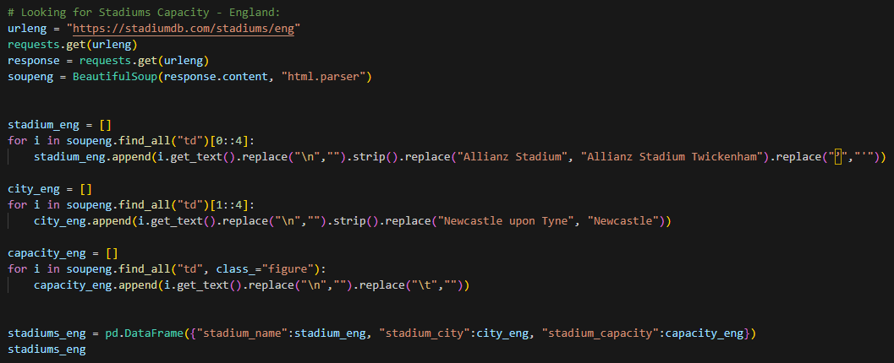
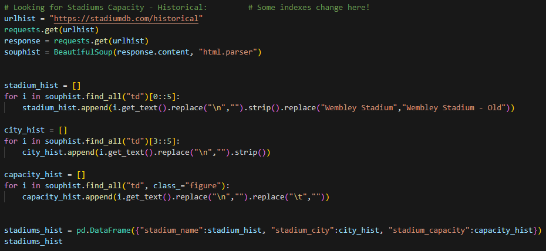

**8**. Once all stadiums were webscraped (satdium's name, city and capacity), I created a DataFrame -***stadiums_final***- having all this info together.

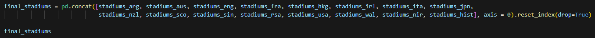

## Data Standardization

**9**. Afterwards, I carried out some *standardization* tasks:
  - Converting stadiums' capacities into **int64**.
  - Converting dates into **datetime**.
  - Firstly dropping matches before 1987, since that's the year of the 1st Rugby World Cup.
  - Grouping competitions into 4 different classes -> **Test Matches**, **Rugby Championship**, **Six Nations** and **Rugby World Cup**. The main reason was because competitions' names vary along the years -although being essentially the same-. 
  - I renamed stadiums' names of the original dataset -according to the names I previously webscraped- to be able to merge the info in further steps.

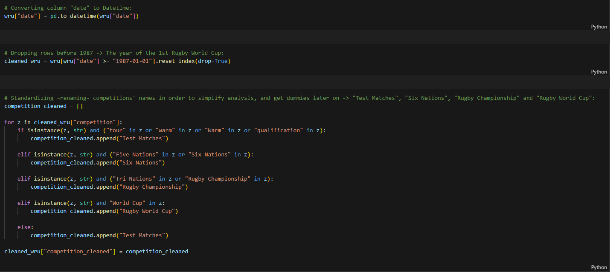
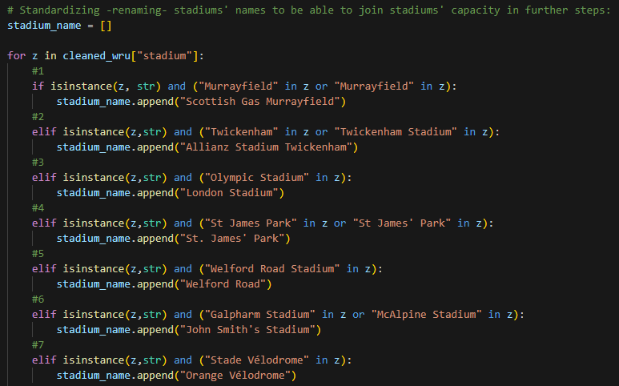
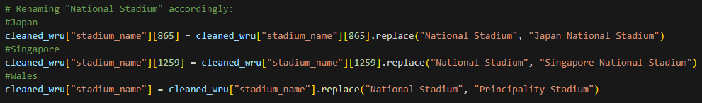

**10**. I created a **new** DataFrame -***wru_intermediate***- where I merged both datasets "*original*" and "*stadiums_final*", and I dropped some duplicated columns ("***competition***", "***stadium***" and "***city***").

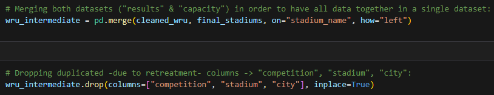

**11**. I did few vizzes (Hitsplots and Scatterplots) between some independent potential variables (X) of the model; for instance, between column "***capacity***" and "***home_score***", "***away_score***" or "***score_diff***". I also did a **Correlation Matrix** for all variables having numerical data so far.

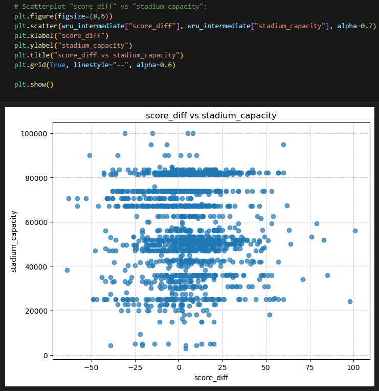

**12**. I created a new column "***jet_lag***" to consider some *jet-lag effect* in the final *Machine Learning* model -> If the "***away_team***" was playing the match in a country being of a different continent than its own -and not being a World Cup's match-, then such a team was suffering of jet-lag. Otherwise, it wasn't.

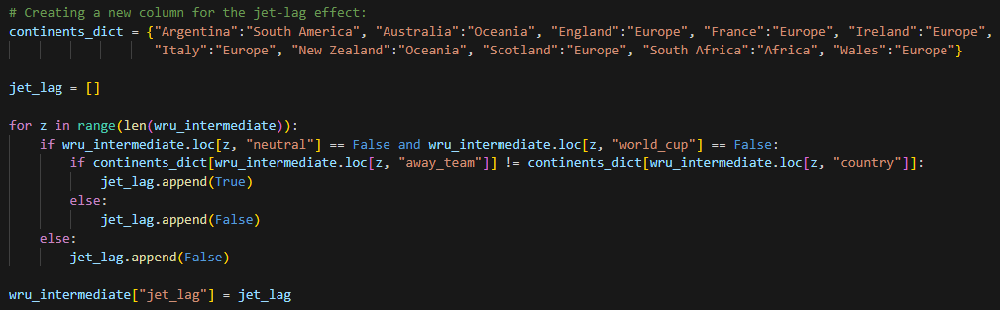

**13**. I also included 2 new columns, "***home_ranking***" and "***away_ranking***", where the ranking of each team was returned for each of the years a given match was played.

For simplicity reasons -not the best approach-, I took the ranking of each team at the end of such a given year.

Since the first available ranking is for 2003 -according to WRU-, I finally dropped all matches played before that year too; creating a new DataFrame -***wru_final***-.

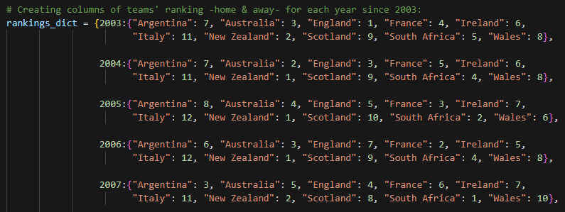

## Machine Learning

**14**. Once I had the ultimate dataset ready, I started considering the **Machine Learning** model -> ***Logistic Regression***:
  - **14.1**. I created a new column "***home_win***", where it returned *True* if the "***score_diff***" was positive; and it returned *False* otherwise. This variable was used as the ***target*** (y) of the model.

  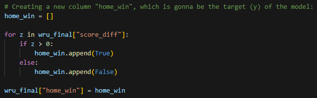

  - **14.2**. I created **dummy** variables out of the previously standardized competitions' names -> **Test Matches**, **Rugby Championship**, **Six Nations** and **Rugby World Cup**.

  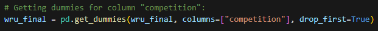

  - **14.3**. I also did a couple of scatterplots between both the "***home_score***" and "***away_score***" (*independent variables*), and the "***home_win***" (*dependent variable*) to see the corresponding data distribution.

  - **14.4**. In order to get a reference score for the model, I computed the "***home_win***" / "***total matches***" ratio -> `59.32%`.

  - **14.5**. I did a version of the model, where from my ultimate dataset ***wru_final***:
    - I dropped some variables since they seemed to be not significant or redundant; for instance, "***home_score***", "***away_score***", "***world_cup***", "***score_diff***" or "****city***".
    - I **defined** both all *independent variables (X)* - all but "***home_win***"- and the *dependent variable (y)* -"***home_win***"-.
    - I **split** the data between *train* and *test* for both all *independent variables (X)* and the *dependent variable (y)*.
    - I **defined** the model.
    - I **scored** the model.

    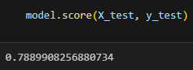

    - I printed a **Confusion matrix** of the model.

    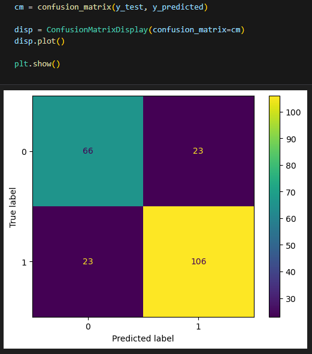

    - I printed the **metrics** -Precision, Recall, F1-Score- of the model.

    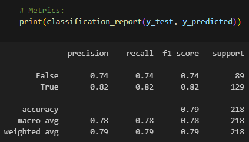

    - I printed the **ROC curve** of the model.

    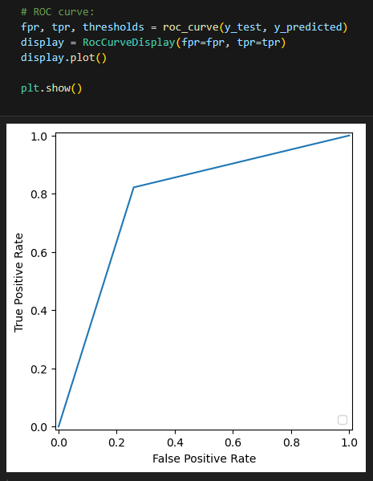

    - I finally played with some **predictions** of the model.

    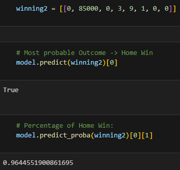
    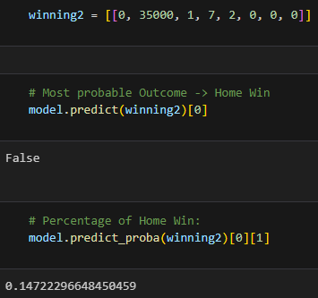

**15**. I applyed a new model, based on ***KNN Classification***, in order to compare the resulting score with the previous ***Logistics Regression*** model; as well as with the initially computed "***home_win***" / "***total matches***" ratio.

## More insights

**16**. To finish this exercise, I also took some **insights** based on the data out of the ultimate dataset; for instance:
  - Split of the jet-lag effect by country.

  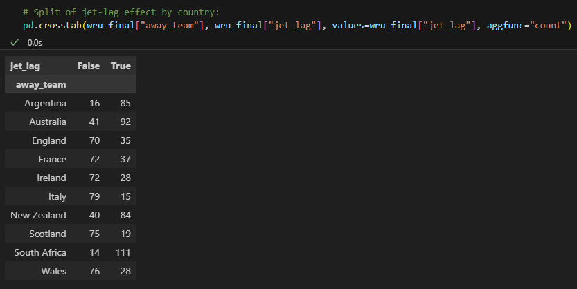

  - Count of "***home_win***" by "***home_team***".

  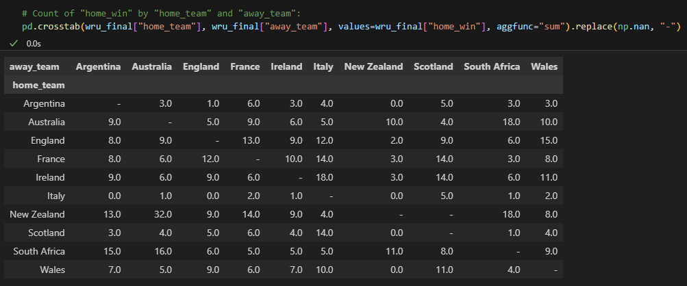

  - Sum of "***score_diff***" by "***home_team***".

  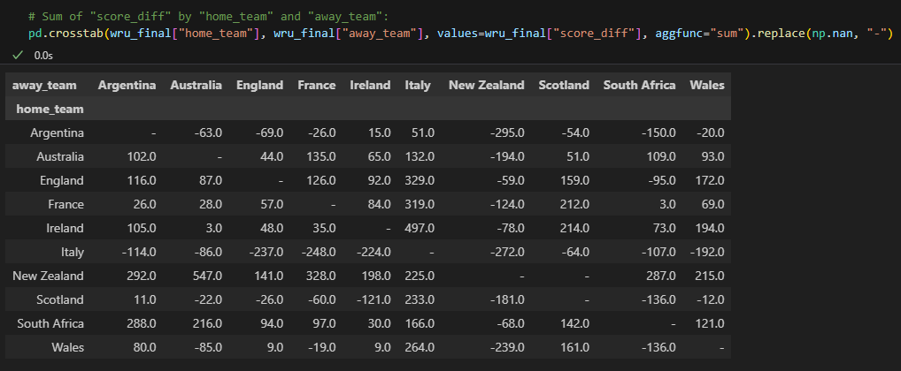

  - Minimum, maximum and mean score by both "***home_team***" and "***away_team***".

  
  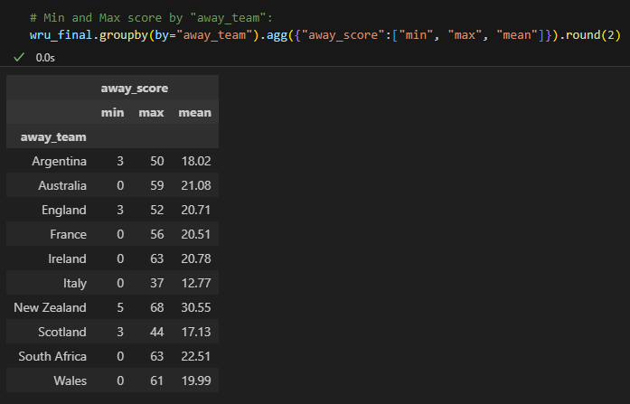

  - Minimum, maximum and mean "***score_diff***" by "***home_team***", and each "***away_team***".